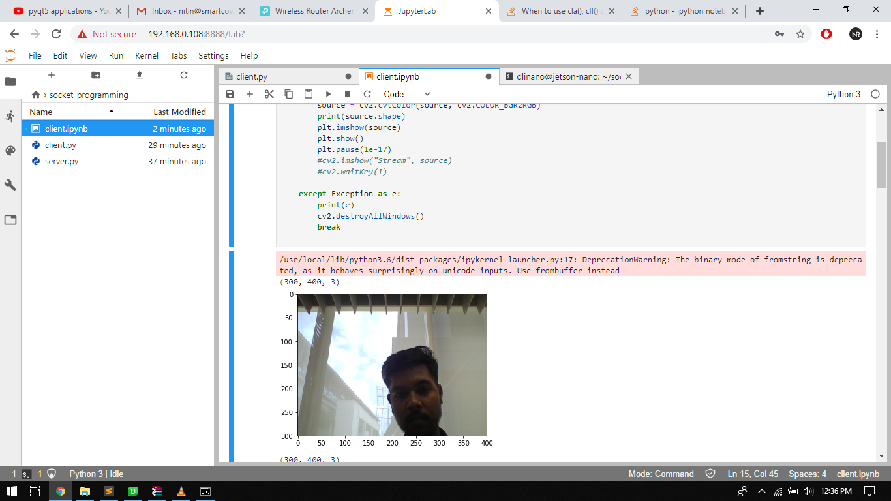

### Don't have a webcam??

Still wants to test image recognition on Jetson nano.

So this repo handles the exact same problem, so i have a jetson nano and a laptop with a webcam but i can't connect my laptop's camera to nano.

so, i decided to stream my laptop camera feeds directly to nano over local networks. with this i will be able to process any live video using jetson nano.

### First things first

so before you start jumping to the files, first  install some of the dependencies.

````python
pip install -r requirments.txt
````

#### How to use the code

Simply move the ``server/server.py`` file to your laptop or any pc where you have a wifi connectivity and a webcam installed. this computer will be used to stream the camera feed over the network.

Secondly move the ``client/client.py`` OR ``client/client.ipynb (incase you are running the nano headlessly)`` to the Nano itself..

don't forget to edit the ``server/server.py`` file and change the ip address with the ip address of the jetson nano as per your network.

do a ``ssh`` connection with nano or simply you can connect it using jupyter lab if it is installed.

so when you will run the ``client/client.py`` using your ``ssh`` console it will print out the dimensions of the received image that means you are receiving the feeds successfully.

#### Here's how i  tested it out



